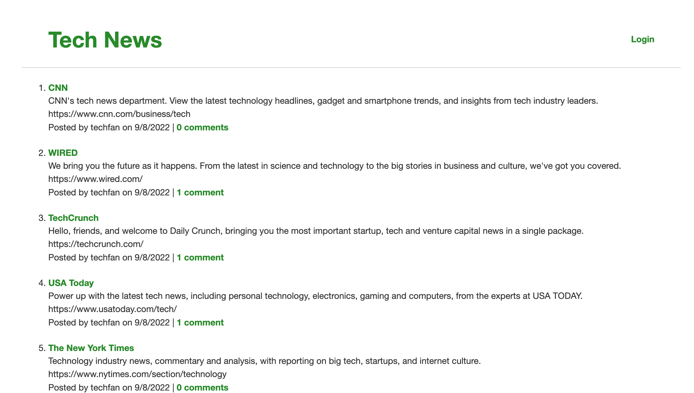

# Tech Blog

## Description
Tech news blog where users can create their own posts about tech news outlets and comment on other users' posts.

## License  
This application is covered under the following license. Please review the link below for additional information pertaining to the license.
    
  
https://www.gnu.org/licenses/gpl-3.0

## Table of Contents
[Deployed Application](#deployed-application)  
[Built With](#built-with)  
[Landing Page](#landing-page)  
[Installation](#installation)   
[Testing](#testing)  
[Contribution](#contribution)  

## Deployed Application
https://tech-news-blog-dch.herokuapp.com/  

## Built With
* JavaScript
* Node.js
* Express.js
* MySQL2
* Sequelize
* Sessions
* dotenv
* bcrypt
* Handlebars
* HTML
* CSS
* Jest
* Git
* Insomnia
* Heroku
* JawsDB

## Landing Page

## Installation
To run locally once cloned:
* Enter `npm install` in the CLI to install the required npm packages
* Create a .env file in the root folder and add the following lines to the file, filling in your MySQL password:

    `DB_NAME='just_tech_news_db'`  
    `DB_USER='root'`  
    `DB_PASSWORD=''` 

* Enter `mysql -u root -p` in the CLI and enter your MySQL password to navigate to the MySQL Shell
* Enter `source db/schema.sql` in the MySQL Shell to create the `tech_blog_db` database
* Exit the MySQL Shell and enter `npm run seed` in the CLI to seed the database
* Enter `npm start` in the CLI to launch live server
* Routes can tested and database can be edited via an API development platform such as Insomnia

## Testing
* Enter `npm test` in the CLI while in the root folder to run Jest

## Contribution
Built by Dylan Hay